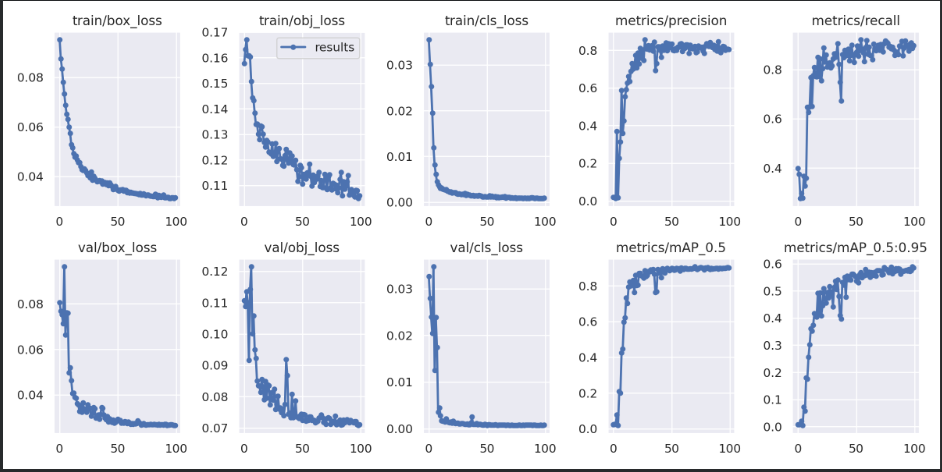
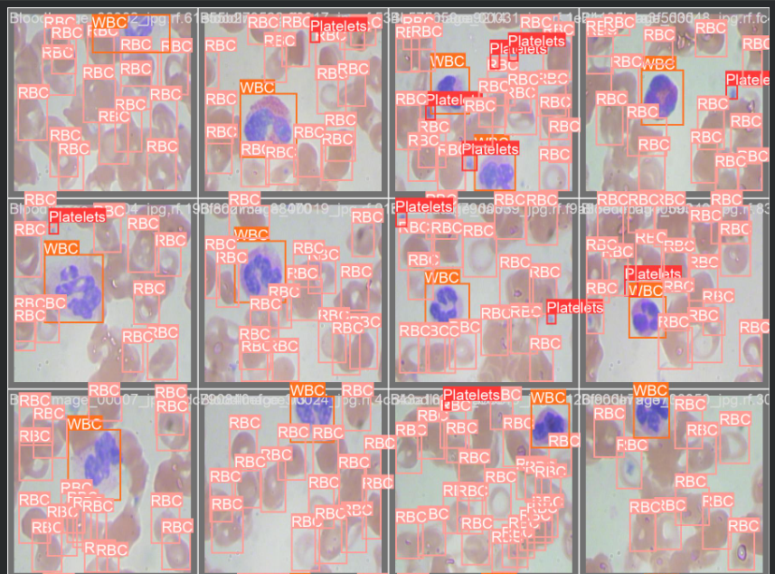
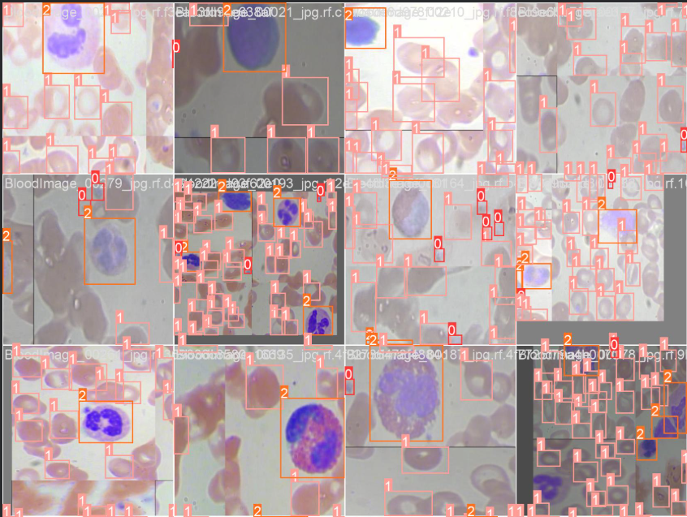

# Automated Blood Cell Detection using YOLOv5

This project implements a deep learning based system for detecting and classifying blood cells from microscopic blood smear images using the YOLOv5 object detection framework.

The model identifies three primary blood cell types:

- Red Blood Cells (RBC)
- White Blood Cells (WBC)
- Platelets

The system is trained on the **BCCD (Blood Cell Count Dataset)** and demonstrates the use of computer vision techniques for automated medical image analysis.

---

# Project Overview

Manual blood cell counting in laboratories is time-consuming and susceptible to human error. This project explores the application of **deep learning based object detection** to automatically identify and classify blood cells from microscopic images.

The YOLOv5 model predicts bounding boxes and labels for each detected blood cell, enabling automated counting and classification.

---

# Technologies Used

- Python
- PyTorch
- YOLOv5
- OpenCV
- Google Colab
- Roboflow

---

# Dataset

The model is trained using the **BCCD (Blood Cell Count Dataset)**.

Dataset Link:

https://github.com/Shenggan/BCCD_Dataset

The dataset contains annotated microscopic blood smear images with bounding boxes for:

- Red Blood Cells (RBC)
- White Blood Cells (WBC)
- Platelets

---

# Repository Structure
---
automated-blood-cell-detection
│
├── docs
│ └── project_report.pdf
│
├── notebook
│ └── blood_cell_detection.ipynb
│
├── screenshots
│ ├── training_results.png
│ ├── detected_image.png
│ └── ground_truth_augmented.png

│
└── README.md
---

---

# Model Training

The YOLOv5 object detection model was trained on annotated blood smear images to detect and classify different blood cell types. The training process was conducted using **Google Colab with GPU acceleration**.

The model learns spatial features and predicts bounding boxes around detected blood cells along with their corresponding class labels.

---

# Detection Results

Example outputs from the trained YOLOv5 model.

### Training Performance

### Model Detection Output

### Ground Truth with Augmented Labels

### Test Input Image

---

# References

- YOLOv5 – Ultralytics
- BCCD Dataset
[1] D. Trong Luong, D. Duy Anh, T. Xuan Thang, H. Thi Lan Huong, T. Thuy Hanh and D. Minh Khanh, "Distinguish 
normal white blood cells from leukemia cells by detection, classification, and counting blood cells using YOLOv5," 2022 
7th National Scientific Conference on Applying New Technology in Green Buildings (ATiGB), Da Nang, Vietnam, 2022, pp. 
156-160, doi: 10.1109/ATiGB56486.2022.9984098.
[2] V. B. Inchur, L. S. Praveen and P. Shankpal, "Implementation of Blood Cell Counting Algorithm using Digital Image 
Processing Techniques," 2020 International Conference on Recent Trends on Electronics, Information, Communication & 
Technology (RTEICT), Bangalore, India, 2020, pp. 21-26, doi: 10.1109/RTEICT49044.2020.9315603. 

